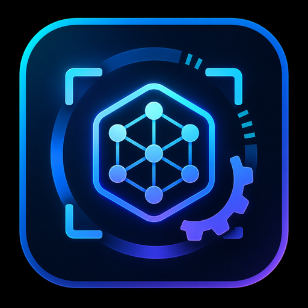

# VisionForge

<div align="center">
  
  <h1>⚡ VisionForge</h1>
  <p>AI 目标检测与实时推理引擎</p>
  
  [](https://github.com/SuperZhao666/VisionForge)
  [](LICENSE)
  [](https://github.com/SuperZhao666/VisionForge/issues)
  [](https://github.com/SuperZhao666/VisionForge/pulls)
  
  [](https://qm.qq.com/cgi-bin/qm/qr?k=U97K77g4eE9pU97K77g4eE9p&jump_from=webapi)
  [](https://t.me/+OdV-iEskI1MzNDll)
</div>

---

## 📋 项目简介

VisionForge 是一款基于 Python 的 AI 目标检测与实时推理引擎，采用 YOLO 模型进行目标识别，支持毫秒级推理速度（单帧推理时间低于 1 毫秒）。项目旨在提供一个开放的技术研究平台，用于探讨计算机视觉、目标跟踪和实时推理等前沿技术。

### 🎮 游戏支持

当前默认提供 **Valorant（无畏契约）** 预训练模型（320×320 分辨率），开箱即可使用。通过更换不同的训练模型，本引擎同样支持多种游戏：

- ✅ **Valorant（无畏契约）** - 默认支持，内置预训练模型
- 🎯 **CS2** - 更换对应模型即可支持
- 🎯 **三角洲行动** - 更换对应模型即可支持
- 🎯 **其他 FPS 游戏** - 只需训练或导入适配的 YOLO 模型

**🔄 模型切换**：只需将训练好的 ONNX 模型文件放入 `vendor_models/` 目录，并修改配置文件中的模型路径即可切换到不同游戏。

**⚠️ 重要声明**：本项目仅供技术研究和学习交流使用，严禁用于任何违法违规行为。作者不承担任何因滥用本项目而产生的法律责任。

### ✨ 核心特性

- **🚀 毫秒级推理**：基于 ONNX Runtime，支持 TensorRT/CUDA/CPU 多后端加速，单帧推理时间低于 1 毫秒
- **🎯 精准目标检测**：YOLO 模型集成，支持多种目标类别识别与定位
- **🔄 智能跟踪算法**：EKF/Kalman 滤波，实现平滑稳定的目标跟踪与锁定
- **⚡ 实时控制**：支持 Leonardo 硬件控制器，实现低延迟实时控制
- **🖥️ 原生 GUI**：Windows 原生桌面应用，中文友好界面，参数可视化调整
- **🛠️ 参数调优**：可视化参数调整器，实时预览推理效果
- **📊 环境诊断**：自动检测 CUDA/cuDNN/TensorRT 环境配置与兼容性
- **🔒 模块化设计**：清晰的架构设计，易于扩展和二次开发

### 📁 项目结构

```
VisionForge/
├── src/              # 核心源代码
│   ├── onnx_yolo_detector.py   # YOLO 检测器
│   ├── target_lock.py          # 目标锁定模块
│   ├── tracker.py              # 跟踪器
│   ├── control_gate.py         # 控制门限
│   └── runtime_controller.py   # 运行时控制器
├── tools/            # 工具脚本
│   ├── config_tuner_gui.py     # 参数调优 GUI
│   └── env_diagnostics.py      # 环境诊断工具
├── scripts/          # 运行脚本
├── vendor_models/    # 预训练模型
├── assets/           # 资源文件
└── firmware/         # 硬件固件
```

---

## 🚀 快速开始

### 🔧 环境要求

- Windows 10/11 (64-bit)
- Python 3.10+
- NVIDIA GPU (推荐，支持 TensorRT/CUDA)
- CUDA 12.x + cuDNN 9.x (可选，GPU 加速)

### 📥 安装步骤

```bash
# 克隆仓库
git clone https://github.com/SuperZhao666/VisionForge.git
cd VisionForge

# 创建虚拟环境
python -m venv .venv

# 激活虚拟环境
.venv\Scripts\activate

# 安装依赖
pip install -r requirements.txt
```

### ▶️ 运行方式

#### 方式一：桌面 GUI（推荐）

```bash
scripts\run_desktop_gui.bat
```

#### 方式二：实时控制

```bash
scripts\run_realtime_control.bat
```

#### 方式三：预览模式

```bash
scripts\run_realtime_preview.bat
```

---

## 📦 发布版本

我们提供预编译的 Windows 单文件可执行程序，无需安装 Python 环境即可运行。

### 📥 下载地址

最新发布版本请访问 [GitHub Releases](https://github.com/SuperZhao666/VisionForge/releases)

### 📝 更新日志

详细的更新记录请查看项目发布页面。

---

## 🤝 贡献指南

欢迎各种形式的贡献！无论是代码提交、问题报告还是功能建议，我们都非常感谢。

### 🐛 报告问题

如果您发现任何 Bug 或有改进建议，请在 [Issues](https://github.com/SuperZhao666/VisionForge/issues) 页面提交。

提交问题时请包含：
- 问题描述
- 复现步骤
- 环境信息（Windows 版本、GPU 型号、Python 版本）
- 错误日志（如有）

### 🔧 代码贡献

1. Fork 本仓库
2. 创建功能分支 (`git checkout -b feature/your-feature`)
3. 提交更改 (`git commit -m 'Add some feature'`)
4. 推送到分支 (`git push origin feature/your-feature`)
5. 创建 Pull Request

---

## 💬 社区交流

加入我们的社区，获取最新动态和技术支持！

| 平台 | 链接 |
|------|------|
| QQ 群 | 1044257667 |
| Telegram | [https://t.me/+OdV-iEskI1MzNDll](https://t.me/+OdV-iEskI1MzNDll) |

### 🎁 免费体验

加入社区即可获得 **免费的一周试用许可**，欢迎大家来测试！

---

## 📜 许可证

本项目采用 **MIT License** 开源许可证，详见 [LICENSE](LICENSE) 文件。

---

## 🙏 致谢

感谢以下开源项目和技术：

- [ONNX Runtime](https://onnxruntime.ai/) - 高性能推理引擎
- [YOLO](https://github.com/ultralytics/yolov5) - 目标检测模型
- [OpenCV](https://opencv.org/) - 计算机视觉库
- [NumPy](https://numpy.org/) - 数值计算库
- [PyInstaller](https://pyinstaller.org/) - 打包工具

---

<div align="center">
  <p>⭐ 如果这个项目对您有帮助，请给我们一个 Star！</p>
</div>